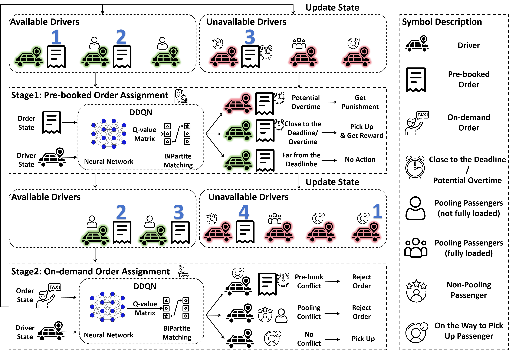
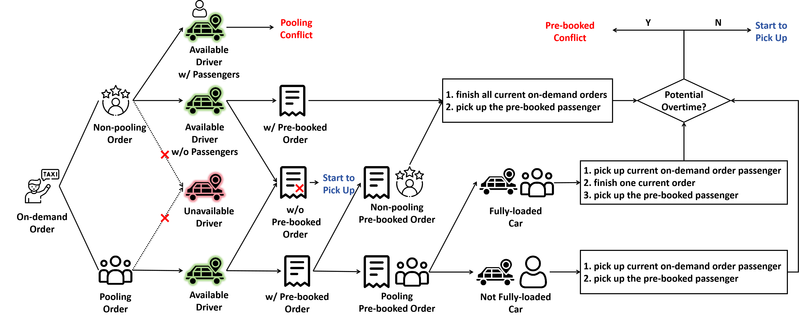

# Mixture of On-Demand and Pre-Booked Ride Sharing System

**Article:** 

Journal Version: Zijian Zhao, Jing Gao*, Sen Li, "Real-Time Order Assignment for Ride-Sharing Platforms with a Mixture of Pre-booked and On-Demand Requests" (under review)

Conference Version: Zijian Zhao, Jing Gao*, Sen Li, "Ride-Hailing Order Dispatching with A Mixture of On-Demand and Pre-Booked Requests via Reinforcement Learning", 2026 COTA International Conference of Transportation Professionals (CICTP 2026)


## 1. Workflow






## 2. Preparation

### 2.1 Dataset

In our paper, we utilize the yellow taxi data from July 1, 2024, between 7:00 and 8:00 AM in Manhattan, sourced from [TLC Trip Record Data - TLC](https://www.nyc.gov/site/tlc/about/tlc-trip-record-data.page). Both the raw data and our processed results are stored in the `./data` folder. You can easily modify the time settings in `main.py` to train or evaluate the model for different time periods. However, if you wish to use data from other districts, you'll need to preprocess it according to the steps outlined in `./data/Manhattan_dic.py`. Additionally, you will need to adjust the `norm` function in `Worker.py` to set the appropriate range for latitude and longitude. While it's possible to skip normalization, doing so may negatively impact performance.

~~The processed data can be found in the `./data` directory.~~

Considering the copyright, we have removed the processed data. However, the data processing code is available in the `./data` directory. Please download the dataset from the link provided above and use our code to process it.

### 2.2 OSRM

Before executing the code, you must first start the Docker container for [OSRM](https://github.com/Project-OSRM/osrm-backend) (specifically for the northeastern region of the US). To prevent any port conflicts with our other projects, we will use port 6000 instead of the default:

```shell
docker run -t -i -p 6000:6000 -v "${PWD}:/data" ghcr.io/project-osrm/osrm-backend osrm-routed --algorithm mld /data/us-northeast-latest.osrm -p 6000
```


## 3. How to Run

### 3.1 Train

#### 3.1.1 Train for a General Strategy

In this mode, the proportions of pre-booked orders, pooling orders, and the appearance times of pre-booked orders are randomized in each episode. This approach helps develop a robust strategy with minimal performance sacrifice.

```shell
python train.py --bi_direction --rand_rate --rand_appear
```

#### 3.1.2 Train for a Specific Strategy

To achieve optimal performance for specific conditions, you can train the model using the following command:

```shell
python train.py --advance_time <time when pre-booked orders start to appear in adavance> --pooling_rate <proportion of customers choosing pooling> --prebooked_rate <proportion of pre-booked orders in total orders>
```

It would be beneficial to first pre-train a general strategy and then fine-tune the model for specific scenarios. To do this, you should load the pre-trained model parameters using `--model_path <pre-trained model path>`.

### 3.2 Evaluate

```shell
python eval.py --bi_direction --model_path <trained model path> --prebooked_rate <a list of your evaluation scenarios> --pooling_rate <a list of your evaluation scenarios> --advance_time <a list of your evaluation scenarios>
```


## 4. Citation

```

```

