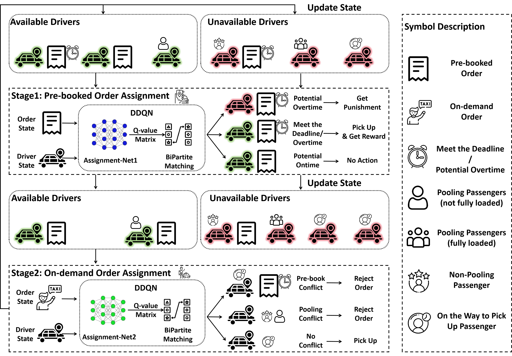

# D³QN

**Article:** "Ride-hailing Vehicle Dispatching with a Mixture of On-demand and Pre-booked Requests: A Multi-Action and Multi-Agent Reinforcement Learning Approach"


The detail of the network structure can be found in [Double-PDF](https://github.com/RS2002/Double-PDF).


## 1. Workflow




## 2. Preparation

### 2.1 Dataset

In our paper, we utilize the yellow taxi data from July 1, 2024, between 7:00 and 8:00 AM in Manhattan, sourced from [TLC Trip Record Data - TLC](https://www.nyc.gov/site/tlc/about/tlc-trip-record-data.page). Both the raw data and our processed results are stored in the `./data` folder. You can easily modify the time settings in `main.py` to train or evaluate the model for different time periods. However, if you wish to use data from other districts, you'll need to preprocess it according to the steps outlined in `./data/Manhattan_dic.py`. Additionally, you will need to adjust the `norm` function in `Worker.py` to set the appropriate range for latitude and longitude. While it's possible to skip normalization, doing so may negatively impact performance.


### 2.2 OSRM

Before executing the code, you must first start the Docker container for [OSRM](https://github.com/Project-OSRM/osrm-backend) (specifically for the northeastern region of the US). To prevent any port conflicts with our other projects, we will use port 6000 instead of the default:

```shell
docker run -t -i -p 6000:6000 -v "${PWD}:/data" ghcr.io/project-osrm/osrm-backend osrm-routed --algorithm mld /data/us-northeast-latest.osrm -p 6000
```


## 3. How to Run

### 3.0 Our Setting

The simulation parameters in our paper are as follows:

1. **Total Simulation Time:** 60 minutes
2. **Order Distribution:** Pre-booked orders appear only in the last 30 minutes, although platforms can access their information in advance

You can modify these settings by editing the `Order_Env.py` file. Additionally, the order distribution and appearance times can be adjusted using parameters in argparse as shown below.


### 3.1 Train

#### 3.1.1 Train for a General Strategy

```shell
python main.py --rand_rate --rand_appear
```

In this mode, the proportions of pre-booked orders, pooling orders, and the appearance times of pre-booked orders are randomized in each episode. This approach helps develop a robust strategy with minimal performance sacrifice.


To achieve optimal performance for specific conditions, you can train the model using the following command:

#### 3.1.2 Train for a Specific Strategy

```shell
python main.py --prebook_start <time when pre-booked orders start to appear> --prebook_end <time when all pre-booked orders have appeared> --pooling_rate <proportion of customers choosing pooling> --prebooked_rate <proportion of pre-booked orders in total orders>
```


## 4. Citation

```

```

